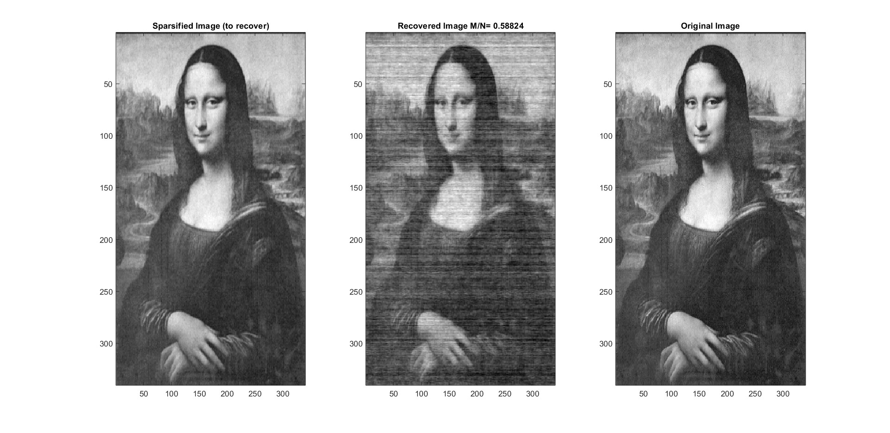

# OMP

Sparse signal recovery using **Orthogonal Matching Pursuit**.

UCSD ECE269 - Linear Algebra and Application

Programming Assignment

---
OMP code for:

i) Recovery when noise is not present.

ii) Recovery when noise is present.

iii) Reconstruction of an image.

---

You can read what OMP does with the following resources:

[Greed is Good by J.A. Tropp](https://ieeexplore.ieee.org/document/1337101)

[Signal Recovery from Random Measurements by J.A. Tropp](http://www.stat.yale.edu/~snn7/courses/stat679fa13/references/omptrogil.pdf)

A useful and short guide:
[Guide](https://kore76.files.wordpress.com/2014/10/tutorial_orthogonal_matching_pursuit_mod2.pdf)
